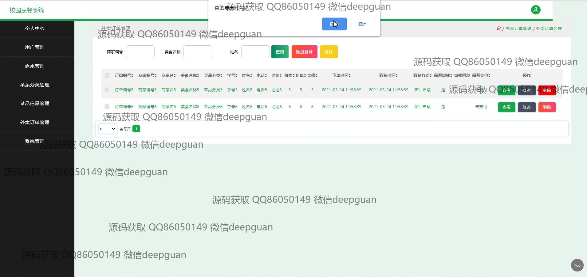
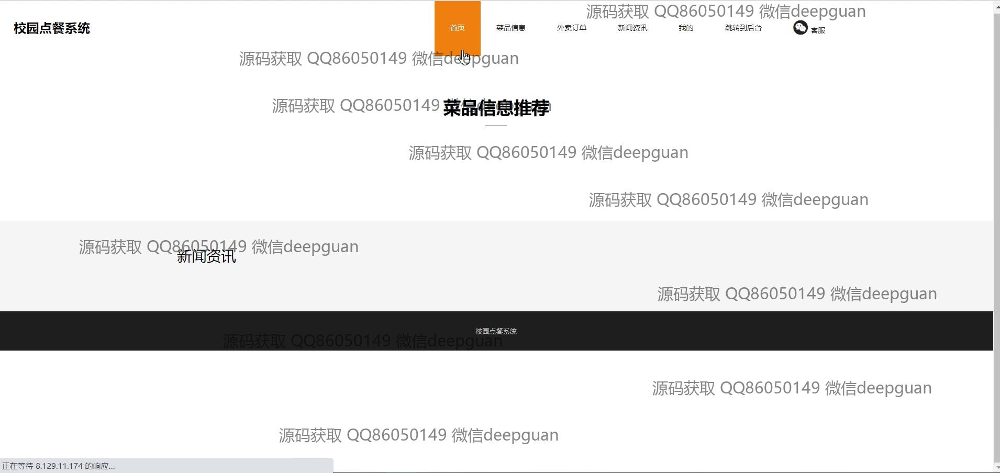
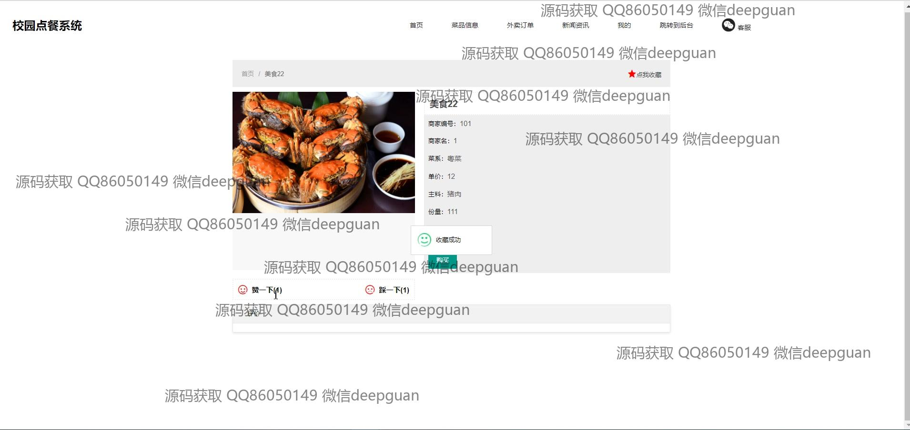
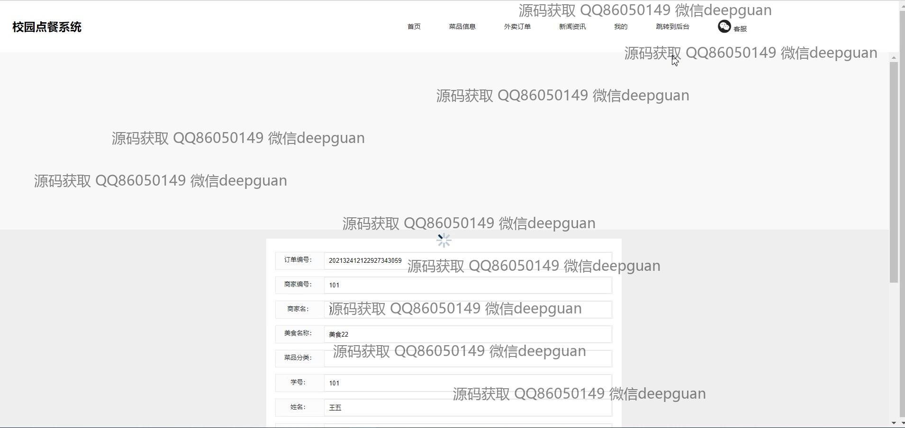
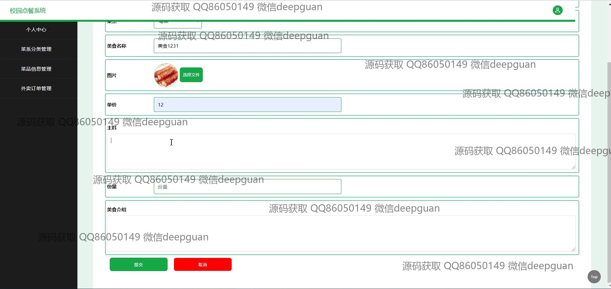

<h1 align="center">的校园食堂外卖点餐系统</h1>

## 简介
校园食堂外卖点餐系统：角色分为管理员、用户，功能包括菜品信息管理、订单管理、商家信息管理、用户管理、菜系分类管理，提供便捷的在线点餐、菜品评价和管理功能。    --计算机毕业设计源码；毕设源码；java毕业设计源码

## 联系方式

<h3 align="center">获取完整代码与数据库文件 + 微信：deepguan QQ: 86050149 QQ群: 783742310</h3>

<h3 align="center">可帮忙远程部署 包运行成功！提供远程部署、修改代码、设计文档指导、代码讲解等服务！</h3>

## 功能介绍（完整见运行截图）
管理员：提供登录与注册功能，具备全面的系统管理权限。能够管理用户、商家、菜系、菜品信息以及外卖订单。支持编辑和更新菜品信息，管理商家和用户信息审核，商家资料编辑、审核回复等操作。管理员还可以通过条件查询、批量删除、审核或修改订单状态来高效管理外卖订单的整个流程。

商家：具备商家专属的登录与注册功能，可以自身管理菜品信息，包括上传图片、设置菜品价格、描述和修改菜品介绍。商家也可管理店铺详情，如联系方式、地址，并上传相关资质文件。商家同时接受系统中的订单，更新订单信息，参与与用户的互动，通过系统反馈查看用户评论，提高服务质量。

用户：提供友好的登录注册界面，可以方便用户浏览菜品信息和商家详情。具备收藏、评论、购买功能，以便于用户快速找到感兴趣的菜品。通过导航栏，用户可查看新闻资讯、进行点餐操作，查询并管理自己的订单详情以及账户信息。在需要时，用户能够通过客服系统获得帮助和技术支持。

系统：作为整体解决方案，支持多个模块的集成与协作，实现校园食堂外卖的自动化管理。包括用户信息的有效管理、商家资质的审核，菜品查询、搜索功能，及外卖订单的全程管理；系统旨在提升用户使用体验，确保快速与高效的点餐服务流程，简化并加快信息处理与操作反馈。

## 运行截图

本代码来源于网络,仅供学习参考使用!

